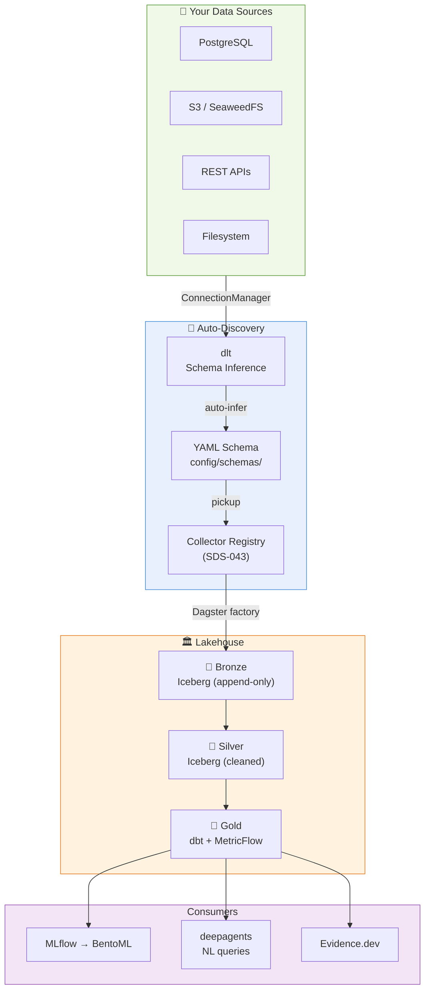

# SoloDShouse

<h3 align="center">Domain-Agnostic Data Platform</h3>

<p align="center">
  Local-first data lakehouse + ML + AI agent platform.<br>
  Full stack on a single machine — zero cloud surprise bills. Zero vendor lock-in.
</p>

<p align="center">
  
  
  
  
  
  
</p>

---

> **Fork of [SoloLakehouse v2.5](https://github.com/Jiahong-Que-9527/SoloLakehouse).**
> Domain pivot: ECB/DAX financial data → ENTSO-E European energy data + AI inference cost analytics.
> Original docs preserved in [`docs/sololakehouse_legacy_docs/`](docs/sololakehouse_legacy_docs/).

---

## What Is This

**SoloDShouse** is a complete, self-hosted, domain-agnostic data platform. It ships empty — you bring your data sources.

Three capability layers, zero bundled domains:

| Layer | What it does |
|-------|-------------|
| **Lakehouse** | Connect → Discover → Bronze → Silver → Gold (Apache Iceberg, Dagster, dlt, DuckDB, dbt, Trino) |
| **ML** | Model training, experiment tracking, serving (XGBoost, LightGBM, PyTorch, MLflow, BentoML) |
| **AI Agent** | Natural-language queries over your data (deepagents, Open WebUI, LiteLLM, MCP tools) |

Runs on a Mac Studio M4 Max (64 GB) for development and a €5/month Hetzner VPS for staging. No cloud lock-in.

---

## How It Works



**Adding your own data source:**
1. Add a connection to `config/connections.yaml`
2. dlt auto-discovers the schema → writes YAML config
3. Dagster picks it up — no code changes needed

---

## Tech Stack

### Lakehouse

| Component | Role | RAM |
|-----------|------|:---:|
| SeaweedFS | S3-compatible object store | ~150 MB |
| PostgreSQL 17 + pgvector + PostGIS | Metadata DB + vector store + geo | ~300 MB |
| Apache Hive Metastore | Iceberg catalog for Trino | ~400 MB |
| Trino | Federated SQL across Iceberg + Postgres | ~1.5 GB |
| DuckDB | In-process OLAP for local/agent queries | ~100 MB |
| Apache Iceberg via pyiceberg | Table format — Bronze/Silver/Gold | library |
| dlt | Connection engine + schema discovery | library |
| dbt-core + dbt-duckdb | Silver→Gold transforms + MetricFlow | CLI |
| Dagster | Asset orchestration, schedules, sensors | ~400 MB |

### ML

| Component | Role | RAM |
|-----------|------|:---:|
| MLflow 3.x | Experiment tracking + model registry | ~300 MB |
| BentoML | Classical model serving | ~200 MB |
| XGBoost + LightGBM + scikit-learn | Tabular ML models | library |
| LSTM (PyTorch) | Time-series forecasting | library |

### AI Agent

| Component | Role | RAM |
|-----------|------|:---:|
| deepagents (LangGraph) | Agent harness — reasoning + tool use | ~200 MB |
| FastAPI proxy | OpenAI-compatible API → deepagents | ~50 MB |
| Open WebUI | Self-hosted chat UI | ~300 MB |
| LiteLLM | Unified LLM gateway (100+ providers) | ~150 MB |
| kotaemon + LlamaIndex | RAG with multi-user support + citations | ~1–2 GB |
| mem0 | Structured agent memory | ~100 MB |
| ToolUniverse + FastMCP | 1000+ scientific MCP tools | ~50 MB |
| AGT (Microsoft) | Agent governance / policy enforcement | library |
| garak (NVIDIA) | LLM vulnerability scanner | CLI |
| Adala | Data labeling agent | library |

### Observability

| Component | Role |
|-----------|------|
| Langfuse | LLM traces + eval + prompt management |
| Prometheus + node_exporter | System metrics |
| Alertmanager + Apprise | Alerts to Telegram / Slack |

### BI & Docs

| Component | Role |
|-----------|------|
| Evidence.dev | Primary BI — markdown-first, git-deployable |
| MongoDB 7 | NoSQL document store |
| Astro Starlight | Docs site |
| nginx | Central service portal |

---

## Docker Compose Profiles

| Profile | Services | RAM |
|---------|----------|:---:|
| `core` | Postgres, SeaweedFS, Dagster, Hive, Trino | ~2.8 GB |
| `ml` | core + MLflow, BentoML | ~3.3 GB |
| `agent` | ml + deepagents, Open WebUI, LiteLLM, FastAPI proxy, mem0, kotaemon, ToolUniverse, garak, AGT | ~5.4 GB |
| `observability` | Langfuse, Prometheus, Alertmanager | ~0.45 GB |
| `bi` | Evidence.dev, nginx portal, Astro Starlight | ~0.4 GB |
| **`full`** | core + ml + agent + observability + bi + MongoDB + Adala | **~6.6 GB** |
| `llm-7b` | full + llama.cpp 7B | **~12.6 GB** |
| `llm-70b` | full + vLLM 70B | **~56.6 GB** |
| `+spark` | Spark on-demand add-on | **+4 GB** |

---

## Quick Start

```bash
git clone https://github.com/jrodeiro5/SoloDShouse.git
cd SoloDShouse
cp .env.example .env          # configure your environment
make up                        # starts core profile
make verify                    # health-check all services
make pipeline                  # run Dagster full_pipeline_job
```

**Service UIs after `make up`:**

| UI | URL | Profile |
|----|-----|---------|
| Dagster | http://localhost:3000 | core |
| Open WebUI | http://localhost:3001 | agent |
| Evidence.dev | http://localhost:3002 | bi |
| MLflow | http://localhost:5000 | ml |
| Trino | http://localhost:8080 | core |
| SeaweedFS | http://localhost:9333 | core |
| Langfuse | http://localhost:3003 | observability |
| Portal | http://localhost:8090 | bi |

**Useful make targets:**

```bash
make up              # Start core stack
make down            # Stop (data preserved under docker/data/)
make pipeline        # Run full Dagster pipeline
make dagster-ui      # Open Dagster at http://localhost:3000
make test            # Unit tests (no Docker required)
make lint            # ruff
make typecheck       # mypy
make clean           # Stop + wipe all data
```

---

## Deployment

```
DEV — Mac Studio M4 Max (64 GB, Apple Silicon)
  docker compose --profile full up
  LLM inference: llama.cpp or vLLM locally

STAGING — Hetzner CPX21 (4 GB RAM, 40 GB disk, ~€5/mo)
  docker compose --profile core --profile agent up -d
  LLM: Groq API (free tier) or SSH tunnel to Mac

CI — GitHub Actions
  build → ghcr.io/jrodeiro5/solodshouse-*
  test  → pytest + ruff + mypy
```

> VPS constraint: 4 GB RAM — never run LLM inference there. Route via LiteLLM → Groq API.

---

## Adding Your Data

See [SDS-043](docs/solodshouse/decisions/SDS-043-domain-agnostic-platform.md) and [SDS-044](docs/solodshouse/decisions/SDS-044-connection-layer-dlt.md).

```
1. Add connection → config/connections.yaml
2. Auto-discover   → dlt infers schema → config/schemas/{source}.yaml
3. Auto-pickup     → Dagster generic factory generates assets
```

Supported connection types: `postgres`, `s3`, `rest`, `filesystem`. More via dlt's 30+ built-in connectors.

Secrets encrypted with Fernet (env-injected key). API access via JWT roles (`reader`, `admin`).

---

## Project Layout

```
ingestion/
  collectors/         # Collector registry (SDS-043) — empty by default
    base.py           # BaseCollector ABC
    registry.py       # @register_collector decorator
  bronze_writer.py    # Iceberg append (Bronze layer)
  iceberg_io.py       # append_table, overwrite_table, scan_table
  iceberg_schemas.py  # Iceberg Schema + PartitionSpec

connections/           # SDS-044 connection layer
  manager.py           # YAML-driven ConnectionManager
  vault.py             # Fernet credential encryption
  discovery.py         # dlt schema auto-discovery
  auth.py              # JWT role-based access control

config/
  connections.yaml     # Your data source connections
  schemas/             # Auto-discovered YAML schemas

transformations/       # Silver transforms — empty by default (plugin-based)
  dbt/                 # Silver→Gold dbt models

ml/                    # ML: training, evaluation, serving

agents/
  deepagents_proxy.py  # FastAPI: OpenAI API → deepagents
  tools/               # MCP tools (Iceberg queries)

dagster/
  assets.py            # Generic asset factory (SDS-043)
  definitions.py       # Jobs, schedules, sensors
  resources.py         # IcebergCatalogResource

docs/
  solodshouse/decisions/   # SDS-XXX ADRs
  sololakehouse_legacy_docs/ # Original fork docs (read-only)

tests/                            # Unit tests (mocked I/O, no Docker)
scripts/                          # init-iceberg-namespaces.py, verify-setup.py
```

---

## Documentation

- [Architecture Decision Records](docs/solodshouse/decisions/) — All SDS-XXX ADRs
- [Session Notes](docs/solodshouse/session-memory.md) — Design decisions log
- [SoloLakehouse Legacy Docs](docs/sololakehouse_legacy_docs/) — Upstream ADRs 001–020 (read-only)

---

## Origin

SoloDShouse is a fork of [SoloLakehouse](https://github.com/Jiahong-Que-9527/SoloLakehouse) v2.5.

Key divergences from upstream:

| Aspect | Upstream | SoloDShouse |
|--------|----------|-------------|
| Domain | ECB/DAX financial | Domain-agnostic — connector-based |
| Object store | MinIO (archived) | SeaweedFS |
| Local query | — | DuckDB |
| AI agents | — | deepagents (LangGraph) |
| Local LLM | — | llama.cpp / vLLM + LiteLLM |
| BI | Superset (eliminated) | Evidence.dev |
| Catalog UI | OpenMetadata (eliminated) | dbt docs + MetricFlow |
| Spark | Always-on | On-demand profile |
| Connection layer | Hardcoded collectors | dlt auto-discovery + Fernet vault |

See [SDS ADRs](docs/solodshouse/decisions/) for all fork decisions.

---

## License

[MIT](LICENSE)
