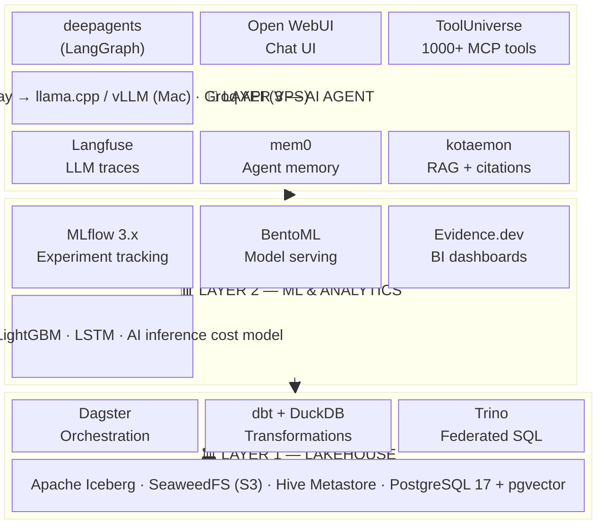
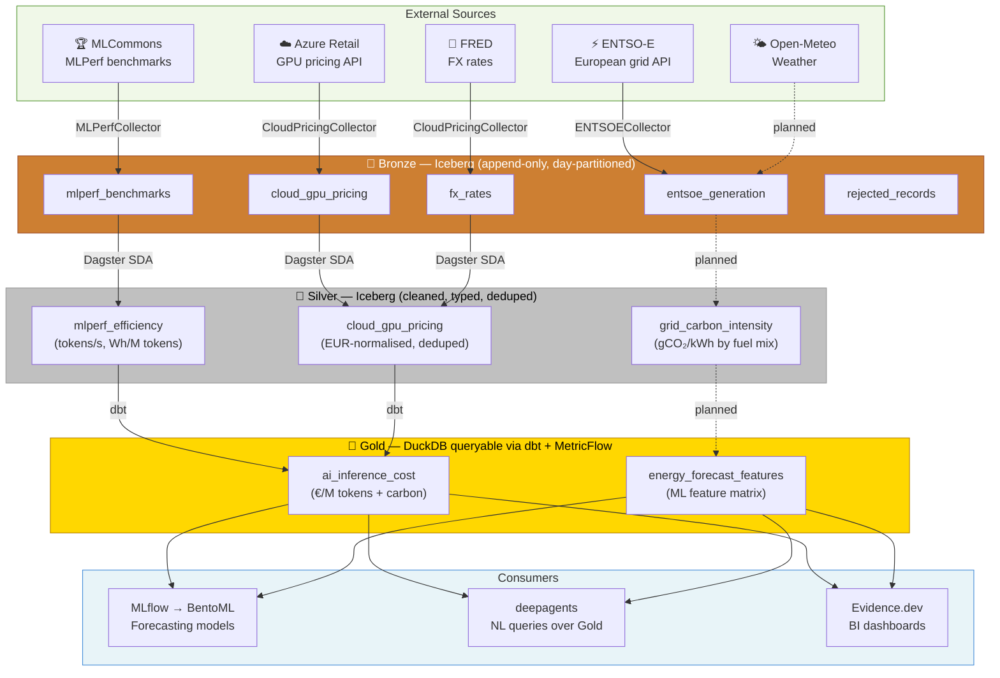

# SoloDShouse

<h3 align="center">Solo Data Science House</h3>

<p align="center">
  Local-first data science + AI agent platform for energy analytics.<br>
  Full ML/AI stack on a single powerful machine — zero cloud surprise bills.
</p>

<p align="center">
  
  
  
  
  
  
</p>

---

> **Fork of [SoloLakehouse v2.5](https://github.com/Jiahong-Que-9527/SoloLakehouse).**
> Domain pivot: ECB/DAX financial data → ENTSO-E European energy data + AI inference cost analytics.
> Original docs preserved in [`docs/sololakehouse_legacy_docs/`](docs/sololakehouse_legacy_docs/).

---

## What Is This

**SoloDShouse** is a complete, self-hosted data science and AI agent platform focused on European energy data.

It extends the SoloLakehouse lakehouse baseline with three additional capability layers:

| Layer | What it does |
|-------|-------------|
| **Lakehouse** | Ingest → Bronze → Silver → Gold (Apache Iceberg, Dagster, DuckDB, dbt, Trino) |
| **ML** | Energy forecasting + AI inference cost modelling (XGBoost, LightGBM, LSTM, MLflow) |
| **AI Agent** | Natural-language queries over energy data (deepagents, Open WebUI, LiteLLM, MCP tools) |

Runs on a Mac Studio M4 Max (64 GB) for development and a €5/month Hetzner VPS for staging. No cloud lock-in.

---

## Platform Architecture

### Capability Layers



### Data Pipeline



> Dashed arrows = planned (blocked on ENTSO-E API key + Phase H dbt scaffold)

---

## Domain: AI Inference Energy & Cost

SoloDShouse tracks the **real cost of running AI** — compute, energy, and money.

| Source | Data | Access |
|--------|------|--------|
| [ENTSO-E Transparency Platform](https://transparency.entsoe.eu/) | European grid generation mix, consumption, prices | Free API (`entsoe-py`), registration required |
| [MLCommons MLPerf Inference](https://mlcommons.org/benchmarks/inference-datacenter/) | GPU throughput benchmarks (tokens/sec, energy/token) | Free CSV download |
| [Azure Retail Prices API](https://prices.azure.com/api/retail/prices) | GPU instance pricing (A100, H100, etc.) | Free, no key |
| [FRED](https://fred.stlouisfed.org/) | EUR/USD exchange rates | Free API key |
| [Open-Meteo](https://open-meteo.com/) | Weather (temperature, wind, solar) | Free, no key |

**Why this domain?** AI inference is the fastest-growing electricity load in Europe. Combining MLPerf benchmarks + Azure pricing + ENTSO-E grid data enables real cost-per-inference analytics tied to actual grid carbon intensity.

---

## Tech Stack

### Infrastructure

| Component | Role | RAM |
|-----------|------|:---:|
| SeaweedFS | S3-compatible object store | ~150 MB |
| PostgreSQL 17 + pgvector + PostGIS | Metadata DB + vector store + geo | ~300 MB |
| Apache Hive Metastore | Iceberg catalog for Trino | ~400 MB |
| Trino | Federated SQL across Iceberg + Postgres | ~1.5 GB |
| DuckDB | In-process OLAP for local/agent queries | ~100 MB |

### Lakehouse

| Component | Role |
|-----------|------|
| Apache Iceberg via pyiceberg | Table format — all Bronze/Silver/Gold layers |
| dbt-core + dbt-duckdb | Silver→Gold transforms + MetricFlow metrics |
| Dagster | Asset orchestration, daily schedules, sensors, asset checks |

### ML

| Component | Role | RAM |
|-----------|------|:---:|
| MLflow 3.x | Experiment tracking + model registry | ~300 MB |
| BentoML | Classical model serving | ~200 MB |
| XGBoost + LightGBM + scikit-learn | Tabular ML models | library |
| LSTM (PyTorch) | Time-series forecasting | library |

### AI Agent

| Component | Role | RAM |
|-----------|------|:---:|
| deepagents (LangGraph) | Agent harness — reasoning + tool use | ~200 MB |
| FastAPI proxy | OpenAI-compatible API → deepagents | ~50 MB |
| Open WebUI | Self-hosted chat UI | ~300 MB |
| LiteLLM | Unified LLM gateway (100+ providers) | ~150 MB |
| kotaemon + LlamaIndex | RAG with multi-user support + citations | ~1–2 GB |
| mem0 | Structured agent memory | ~100 MB |
| ToolUniverse + FastMCP | 1000+ scientific MCP tools | ~50 MB |
| AGT (Microsoft) | Agent governance / policy enforcement | library |
| garak (NVIDIA) | LLM vulnerability scanner | CLI |
| Adala | Data labeling agent | library |

### Observability

| Component | Role |
|-----------|------|
| Langfuse | LLM traces + eval + prompt management |
| Prometheus + node_exporter | System metrics |
| Alertmanager + Apprise | Alerts to Telegram / Slack |

### BI & Docs

| Component | Role |
|-----------|------|
| Evidence.dev | Primary BI — markdown-first, git-deployable |
| MongoDB 7 | NoSQL document store |
| Astro Starlight | Docs site |
| nginx | Central service portal |

---

## Docker Compose Profiles

| Profile | Services | RAM |
|---------|----------|:---:|
| `core` | Postgres, SeaweedFS, Dagster, Hive, Trino | ~2.8 GB |
| `ml` | core + MLflow, BentoML | ~3.3 GB |
| `agent` | ml + deepagents, Open WebUI, LiteLLM, FastAPI proxy, mem0, kotaemon, ToolUniverse, garak, AGT | ~5.4 GB |
| `observability` | Langfuse, Prometheus, Alertmanager | ~0.45 GB |
| `bi` | Evidence.dev, nginx portal, Astro Starlight | ~0.4 GB |
| **`full`** | core + ml + agent + observability + bi + MongoDB + Adala | **~6.6 GB** |
| `llm-7b` | full + llama.cpp 7B | **~12.6 GB** |
| `llm-70b` | full + vLLM 70B | **~56.6 GB** |
| `+spark` | Spark on-demand add-on | **+4 GB** |

---

## Quick Start

```bash
git clone https://github.com/jrodeiro5/SoloDShouse.git
cd SoloDShouse
cp .env.example .env          # set ENTSOE_API_KEY, FRED_API_KEY
make up                        # starts core profile
make verify                    # health-check all services
make pipeline                  # run Dagster full_pipeline_job
```

**Service UIs after `make up`:**

| UI | URL | Profile |
|----|-----|---------|
| Dagster | http://localhost:3000 | core |
| Open WebUI | http://localhost:3001 | agent |
| Evidence.dev | http://localhost:3002 | bi |
| MLflow | http://localhost:5000 | ml |
| Trino | http://localhost:8080 | core |
| SeaweedFS | http://localhost:9333 | core |
| Langfuse | http://localhost:3003 | observability |
| Portal | http://localhost:8090 | bi |

**Useful make targets:**

```bash
make up              # Start core stack
make down            # Stop (data preserved under docker/data/)
make pipeline        # Run full Dagster pipeline
make dagster-ui      # Open Dagster at http://localhost:3000
make test            # Unit tests (no Docker required)
make lint            # ruff
make typecheck       # mypy
make clean           # Stop + wipe all data
```

---

## Deployment

```
DEV — Mac Studio M4 Max (64 GB, Apple Silicon)
  docker compose --profile full up
  LLM inference: llama.cpp or vLLM locally

STAGING — Hetzner CPX21 (4 GB RAM, 40 GB disk, ~€5/mo)
  docker compose --profile core --profile agent up -d
  LLM: Groq API (free tier) or SSH tunnel to Mac

CI — GitHub Actions
  build → ghcr.io/jrodeiro5/solodshouse-*
  test  → pytest + ruff + mypy
```

> VPS constraint: 4 GB RAM — never run LLM inference there. Route via LiteLLM → Groq API.

---

## Monthly Cost

| Item | Cost |
|------|:----:|
| Mac Studio M4 Max | owned |
| Hetzner CPX21 VPS | €5.01 |
| Groq API | €0 (free tier) |
| ENTSO-E API | €0 |
| Open-Meteo API | €0 |
| FRED API | €0 |
| **Total** | **~€5/mo** |

---

## Project Layout

```
ingestion/
  collectors/         # MLPerfCollector, CloudPricingCollector, ENTSOECollector
  schema/             # Pydantic v2 models
  quality/            # Bronze-layer quality checks
  bronze_writer.py    # Iceberg append (Bronze layer)
  iceberg_io.py       # append_table, overwrite_table, scan_table
  iceberg_schemas.py  # Iceberg Schema + PartitionSpec definitions

transformations/
  mlperf_bronze_to_silver.py      # MLPerf efficiency transform
  pricing_bronze_to_silver.py     # Azure GPU pricing: dedup, EUR convert
  dbt/                            # Silver→Gold dbt models (Phase H)

ml/
  train_energy_forecast.py        # XGBoost/LightGBM + LSTM forecasting
  evaluate.py                     # MLflow experiment runner

agents/
  deepagents_proxy.py             # FastAPI: OpenAI API → deepagents
  tools/                          # MCP tools (ENTSO-E queries, Iceberg reads)

dagster/
  assets.py                       # Software-defined assets
  definitions.py                  # Jobs, schedules, sensors
  resources.py                    # IcebergCatalogResource, PipelineConfigResource

docs/
  solodshouse/decisions/          # SDS-XXX Architecture Decision Records
  sololakehouse_legacy_docs/      # Original fork docs (read-only)

tests/                            # Unit tests (mocked I/O, no Docker)
scripts/                          # init-iceberg-namespaces.py, verify-setup.py
```

---

## Documentation

- [Architecture Decision Records](docs/solodshouse/decisions/) — All SDS-XXX ADRs
- [Session Notes](docs/solodshouse/session-memory.md) — Design decisions log
- [SoloLakehouse Legacy Docs](docs/sololakehouse_legacy_docs/) — Upstream ADRs 001–020 (read-only)

---

## Origin

SoloDShouse is a fork of [SoloLakehouse](https://github.com/Jiahong-Que-9527/SoloLakehouse) v2.5.

Key divergences from upstream:

| Aspect | Upstream | SoloDShouse |
|--------|----------|-------------|
| Domain | ECB interest rates + DAX prices | ENTSO-E energy + AI inference cost |
| Object store | MinIO (archived Apr 2026) | SeaweedFS |
| Local query | — | DuckDB |
| AI agents | — | deepagents (LangGraph) |
| Local LLM | — | llama.cpp / vLLM + LiteLLM |
| BI | Superset (eliminated) | Evidence.dev |
| Catalog UI | OpenMetadata (eliminated) | dbt docs + MetricFlow |
| Spark | Always-on | On-demand profile |

See [SDS ADRs](docs/solodshouse/decisions/) for all fork decisions.

---

## License

[MIT](LICENSE)
