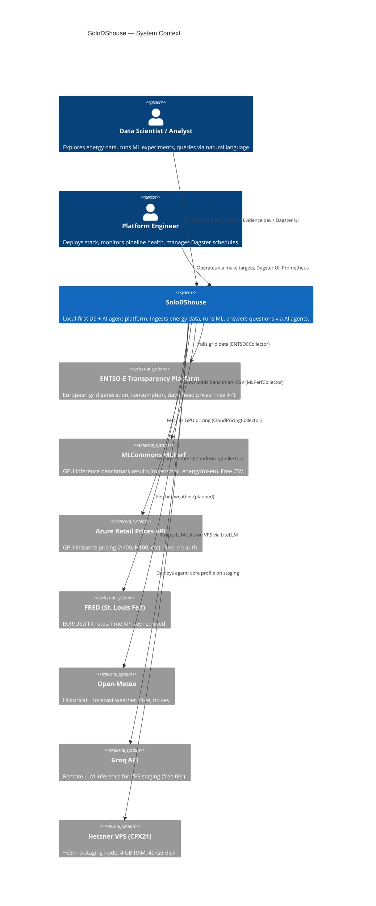

# C1 — System Context

> Who uses SoloDShouse and what external systems does it depend on?

```mermaid
C4Context
  title SoloDShouse — System Context

  Person(analyst, "Data Scientist / Analyst", "Explores energy data, runs ML experiments, queries via natural language")
  Person(engineer, "Platform Engineer", "Deploys stack, monitors pipeline health, manages Dagster schedules")

  System(sds, "SoloDShouse", "Local-first DS + AI agent platform. Ingests energy data, runs ML, answers questions via AI agents.")

  System_Ext(entsoe, "ENTSO-E Transparency Platform", "European grid generation, consumption, day-ahead prices. Free API.")
  System_Ext(mlperf, "MLCommons MLPerf", "GPU inference benchmark results (tokens/sec, energy/token). Free CSV.")
  System_Ext(azure, "Azure Retail Prices API", "GPU instance pricing (A100, H100, etc). Free, no auth.")
  System_Ext(fred, "FRED (St. Louis Fed)", "EUR/USD FX rates. Free API key required.")
  System_Ext(openmeteo, "Open-Meteo", "Historical + forecast weather. Free, no key.")
  System_Ext(groq, "Groq API", "Remote LLM inference for VPS staging (free tier).")
  System_Ext(hetzner, "Hetzner VPS (CPX21)", "~€5/mo staging node. 4 GB RAM, 40 GB disk.")

  Rel(analyst, sds, "Queries via Open WebUI / Evidence.dev / Dagster UI")
  Rel(engineer, sds, "Operates via make targets, Dagster UI, Prometheus")
  Rel(sds, entsoe, "Pulls grid data (ENTSOECollector)")
  Rel(sds, mlperf, "Downloads benchmark CSV (MLPerfCollector)")
  Rel(sds, azure, "Fetches GPU pricing (CloudPricingCollector)")
  Rel(sds, fred, "Fetches FX rates (CloudPricingCollector)")
  Rel(sds, openmeteo, "Fetches weather (planned)")
  Rel(sds, groq, "Routes LLM calls on VPS via LiteLLM")
  Rel(sds, hetzner, "Deploys agent+core profile on staging")

  UpdateLayoutConfig($c4ShapeInRow="3", $c4BoundaryInRow="1")
```
