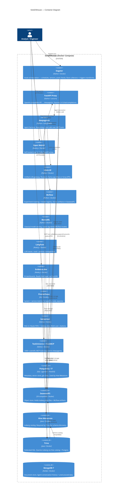

# C2 — Containers

> What Docker services make up SoloDShouse and how do they communicate?

```mermaid
C4Container
  title SoloDShouse — Container Diagram

  Person(user, "Analyst / Engineer")

  System_Boundary(sds, "SoloDShouse (Docker Compose)") {

    Container(dagster, "Dagster", "Python / Docker", "Asset orchestration — schedules, sensors, asset checks. Runs collectors + triggers transforms.")
    Container(fastapi, "FastAPI Proxy", "Python / uvicorn", "OpenAI-compatible API → deepagents. Exposes /v1/chat/completions.")
    Container(deepagents, "deepagents", "Python / LangGraph", "Agent harness. Reasoning + tool calls over MCP tools.")
    Container(openwebui, "Open WebUI", "Node.js / Docker", "Self-hosted chat UI. Calls FastAPI proxy.")
    Container(litellm, "LiteLLM", "Python / Docker", "Unified LLM gateway. Routes to llama.cpp (Mac) or Groq (VPS).")
    Container(mlflow, "MLflow", "Python / Docker", "Experiment tracking + model registry. Stores artifacts in SeaweedFS.")
    Container(bentoml, "BentoML", "Python / Docker", "Classical model serving. Loads registered MLflow models.")
    Container(langfuse, "Langfuse", "Node.js / Docker", "LLM traces + eval + prompt management.")
    Container(evidence, "Evidence.dev", "Node.js / Docker", "BI dashboards. Reads Gold layer via DuckDB.")
    Container(prometheus, "Prometheus", "Go / Docker", "System + service metrics. Scraped by node_exporter.")
    Container(kotaemon, "kotaemon", "Python / Docker", "RAG UI. Reads PDFs + Iceberg data. Multi-user, citations.")
    Container(tooluniv, "ToolUniverse + FastMCP", "Python / Docker", "1000+ scientific MCP tools exposed to deepagents.")

    ContainerDb(postgres, "PostgreSQL 17", "SQL / pgvector / PostGIS", "Metadata, vector store, geo data. Used by Hive Metastore.")
    ContainerDb(seaweedfs, "SeaweedFS", "S3-compatible / Docker", "Object store. Holds Iceberg data files + MLflow artifacts.")
    ContainerDb(hive, "Hive Metastore", "Java / Docker", "Iceberg catalog. Required by Trino for schema discovery.")
    ContainerDb(trino, "Trino", "Java / Docker", "Federated SQL. Queries Iceberg via Hive catalog + Postgres.")
    ContainerDb(mongo, "MongoDB 7", "NoSQL / Docker", "Document store. Agent conversation history + unstructured data.")
  }

  Rel(user, openwebui, "Chat queries", "HTTPS/3001")
  Rel(user, evidence, "BI dashboards", "HTTPS/3002")
  Rel(user, dagster, "Pipeline ops", "HTTPS/3000")
  Rel(user, mlflow, "Experiment tracking", "HTTPS/5000")

  Rel(openwebui, fastapi, "LLM requests", "HTTP/8000")
  Rel(fastapi, deepagents, "Agent invocation", "Python call")
  Rel(deepagents, litellm, "LLM completions", "HTTP")
  Rel(deepagents, tooluniv, "MCP tool calls", "stdio/HTTP")
  Rel(deepagents, trino, "SQL over Gold", "JDBC/8080")

  Rel(dagster, seaweedfs, "Iceberg append/overwrite", "S3 API/8333")
  Rel(dagster, hive, "Catalog ops", "Thrift/9083")
  Rel(dagster, postgres, "Dagster state", "PSQL/5432")

  Rel(mlflow, seaweedfs, "Artifact storage", "S3 API/8333")
  Rel(trino, hive, "Schema catalog", "Thrift/9083")
  Rel(trino, seaweedfs, "Data reads", "S3 API/8333")
  Rel(evidence, trino, "Gold queries", "JDBC/8080")

  Rel(langfuse, postgres, "Trace storage", "PSQL/5432")
  Rel(kotaemon, seaweedfs, "Document storage", "S3 API/8333")

  UpdateLayoutConfig($c4ShapeInRow="4", $c4BoundaryInRow="1")
```
