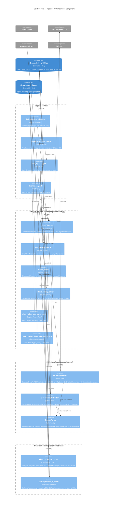

# C3 — Components: Ingestion + Dagster

> How do the ingestion collectors, Dagster assets, and transformations fit together?

```mermaid
C4Component
  title SoloDShouse — Ingestion & Orchestration Components

  System_Ext(entsoe_api, "ENTSO-E API")
  System_Ext(mlperf_csv, "MLCommons CSV")
  System_Ext(azure_api, "Azure Retail API")
  System_Ext(fred_api, "FRED API")

  System_Boundary(dagster_svc, "Dagster Service") {
    Component(scheduler, "daily_pipeline_schedule", "Dagster Schedule", "Fires full_pipeline_job at 07:00 UTC daily")
    Component(sensor, "mlperf_freshness_sensor", "Dagster Sensor", "Polls Bronze table; triggers if data missing or >30 days old")
    Component(job_full, "full_pipeline_job", "Dagster Job", "Runs all Bronze + Silver assets in dependency order")
    Component(job_bronze, "bronze_only_job", "Dagster Job", "Runs Bronze assets only (backfill / debug)")
  }

  System_Boundary(assets, "Software-Defined Assets (dagster/assets.py)") {
    Component(mlperf_b, "mlperf_bronze", "Dagster @asset", "Calls MLPerfCollector. Retries 3x. Emits round_id, valid, rejected metadata.")
    Component(pricing_b, "cloud_pricing_bronze", "Dagster @asset", "Calls CloudPricingCollector. Emits azure_valid, fx_valid counts.")
    Component(mlperf_s, "mlperf_silver", "Dagster @asset", "Calls mlperf_bronze_to_silver.run(). Depends on mlperf_bronze.")
    Component(pricing_s, "cloud_pricing_silver", "Dagster @asset", "Calls pricing_bronze_to_silver.run(). Depends on cloud_pricing_bronze.")
    Component(check1, "mlperf_silver_min_rows_check", "Dagster @asset_check", "Fails if mlperf_efficiency has 0 rows.")
    Component(check2, "cloud_pricing_silver_min_rows_check", "Dagster @asset_check", "Fails if cloud_gpu_pricing has 0 rows.")
  }

  System_Boundary(collectors, "Collectors (ingestion/collectors/)") {
    Component(mlperf_col, "MLPerfCollector", "Python class", "Downloads MLPerf CSV. Validates via MLPerfRecord (Pydantic v2). Checks idempotency via _ingestion_timestamp.")
    Component(pricing_col, "CloudPricingCollector", "Python class", "Fetches Azure GPU pricing + FRED FX. Validates via CloudPricingRecord + FXRecord.")
    Component(writer, "BronzeWriter", "Python class", "Appends validated DataFrames to Iceberg Bronze tables via iceberg_io.append_table.")
  }

  System_Boundary(transforms, "Transformations (transformations/)") {
    Component(t1, "mlperf_bronze_to_silver", "Pure function + run()", "Dedupes, computes max tokens/sec + Wh/M tokens per GPU model per round.")
    Component(t2, "pricing_bronze_to_silver", "Pure function + run()", "Dedupes Azure pricing, converts USD to EUR via fx_rates, maps instance to GPU.")
  }

  ContainerDb(iceberg_bronze, "Bronze Iceberg Tables", "SeaweedFS + Hive", "mlperf_benchmarks, cloud_gpu_pricing, fx_rates, rejected_records")
  ContainerDb(iceberg_silver, "Silver Iceberg Tables", "SeaweedFS + Hive", "mlperf_efficiency, cloud_gpu_pricing")

  Rel(scheduler, job_full, "triggers")
  Rel(sensor, job_full, "triggers if stale")
  Rel(job_full, mlperf_b, "materialises")
  Rel(job_full, pricing_b, "materialises")
  Rel(job_full, mlperf_s, "materialises")
  Rel(job_full, pricing_s, "materialises")
  Rel(job_bronze, mlperf_b, "materialises")
  Rel(job_bronze, pricing_b, "materialises")

  Rel(mlperf_b, mlperf_col, "calls")
  Rel(pricing_b, pricing_col, "calls")
  Rel(mlperf_col, mlperf_csv, "HTTP GET")
  Rel(pricing_col, azure_api, "HTTP GET")
  Rel(pricing_col, fred_api, "HTTP GET")
  Rel(mlperf_col, writer, "writes validated rows")
  Rel(pricing_col, writer, "writes validated rows")
  Rel(writer, iceberg_bronze, "append_table()")

  Rel(mlperf_s, t1, "calls run()")
  Rel(pricing_s, t2, "calls run()")
  Rel(t1, iceberg_bronze, "scan_table()")
  Rel(t1, iceberg_silver, "overwrite_table()")
  Rel(t2, iceberg_bronze, "scan_table()")
  Rel(t2, iceberg_silver, "overwrite_table()")

  Rel(check1, iceberg_silver, "counts rows")
  Rel(check2, iceberg_silver, "counts rows")

  UpdateLayoutConfig($c4ShapeInRow="4", $c4BoundaryInRow="1")
```
