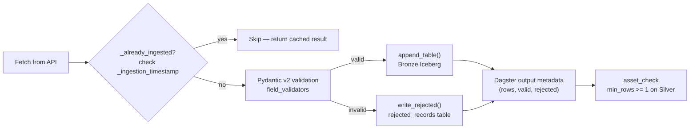
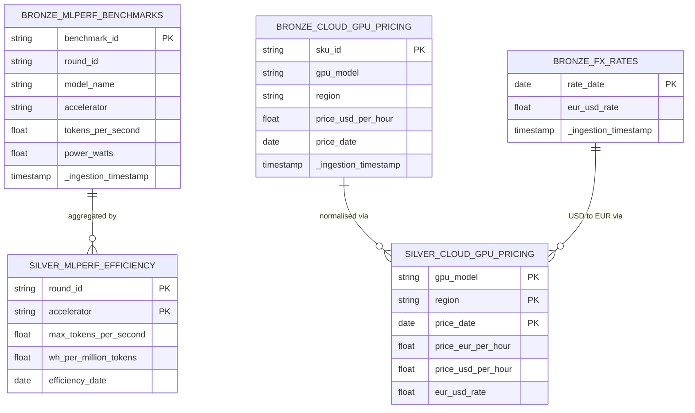

# Data Flow — Medallion Pipeline

> End-to-end data journey from external APIs to AI agent answers.

## Pipeline Flow

```mermaid
flowchart TD
    subgraph ext["External Sources"]
        E["⚡ ENTSO-E\nEuropean grid API"]
        M["🏆 MLCommons\nMLPerf benchmarks CSV"]
        A["☁️ Azure Retail\nGPU instance pricing"]
        F["💱 FRED\nEUR/USD FX rates"]
        W["🌤️ Open-Meteo\nWeather (planned)"]
    end

    subgraph dag["Dagster Orchestration"]
        SCH["⏰ daily_pipeline_schedule\n07:00 UTC"]
        SEN["👁️ mlperf_freshness_sensor\nPoll every 24h"]
    end

    subgraph col["Collectors (ingestion/collectors/)"]
        C1["MLPerfCollector\nHTTP GET → Pydantic validate → idempotency check"]
        C2["CloudPricingCollector\nHTTP GET (Azure + FRED) → validate"]
        C3["ENTSOECollector\n🔒 blocked: needs API key"]
    end

    subgraph bronze["🥉 Bronze — Iceberg (append-only, day-partitioned)"]
        B1[("mlperf_benchmarks")]
        B2[("cloud_gpu_pricing")]
        B3[("fx_rates")]
        B4[("entsoe_generation\n🔒 planned")]
        BR[("rejected_records")]
    end

    subgraph silver["🥈 Silver — Iceberg (full overwrite per run)"]
        S1[("mlperf_efficiency\ntokens/s · Wh/M tokens")]
        S2[("cloud_gpu_pricing\nEUR-normalised · deduped")]
        S3[("grid_carbon_intensity\ngCO₂/kWh · 🔒 planned")]
    end

    subgraph gold["🥇 Gold — dbt + MetricFlow (🔒 Phase H)"]
        G1[("ai_inference_cost\n€/M tokens + carbon intensity")]
        G2[("energy_forecast_features\nML feature matrix")]
    end

    subgraph consume["Consumers"]
        ML["🧪 MLflow → BentoML\nForecasting models"]
        AG["🤖 deepagents\nNL queries via MCP tools"]
        BI["📊 Evidence.dev\nBI dashboards"]
    end

    SCH -->|triggers| C1 & C2
    SEN -->|triggers if stale| C1

    M --> C1
    A & F --> C2
    E -.-> C3

    C1 -->|validate + append| B1
    C1 -->|rejected| BR
    C2 -->|validate + append| B2 & B3
    C2 -->|rejected| BR
    C3 -.->|planned| B4

    B1 -->|mlperf_bronze_to_silver.run()| S1
    B2 & B3 -->|pricing_bronze_to_silver.run()| S2
    B4 -.->|planned| S3

    S1 & S2 -.->|dbt Phase H| G1
    S3 -.->|dbt Phase H| G2

    G1 & G2 -.-> ML
    G1 & G2 -.-> AG
    G1 & G2 -.-> BI

    style bronze fill:#cd7f32,color:#fff,stroke:#a0522d
    style silver fill:#c0c0c0,color:#000,stroke:#999
    style gold fill:#ffd700,color:#000,stroke:#b8860b
    style ext fill:#f0f8e8,stroke:#5a9a3a
    style consume fill:#e8f4f8,stroke:#4a90d9
    style dag fill:#f5f0ff,stroke:#7b5cfe
```

## Idempotency & Quality Controls



## Schema Lineage


