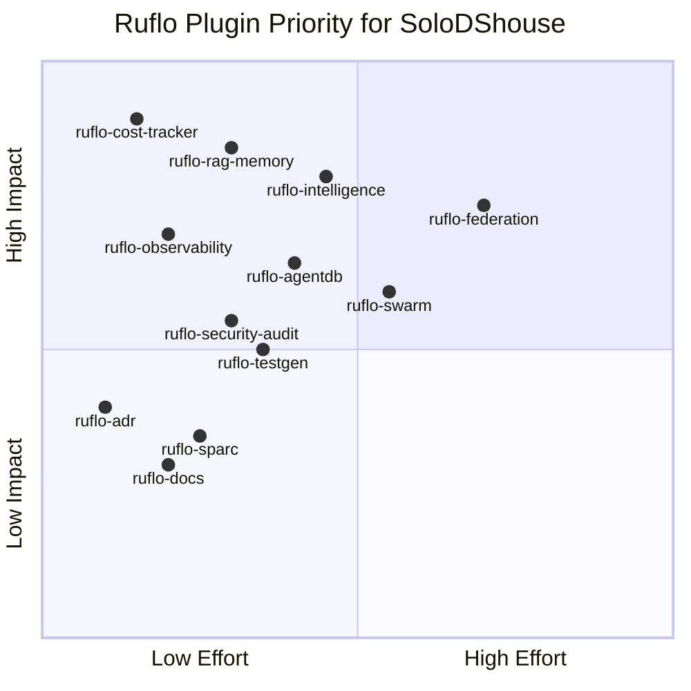
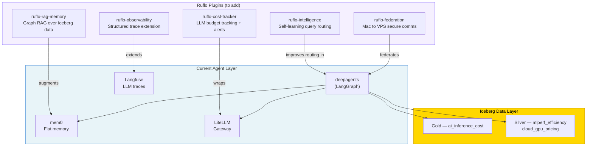

# Ruflo Integration Plan

[Ruflo](https://github.com/ruvnet/ruflo) (formerly claude-flow) is a multi-agent harness for Claude Code: swarm coordination, self-learning memory, Graph RAG, and federated agent communication. Several plugins map directly to SoloDShouse capabilities.

## What Ruflo Provides

- **98 specialized agents** routed automatically via hooks
- **Swarm coordination** — multiple agents collaborate on a single task
- **Self-learning memory** — RuVector graph DB captures successful patterns; agents improve over time
- **Federation** — agents on Mac (dev) and Hetzner VPS (staging) communicate securely without leaking data
- **33 plugins** — install only what you need

Two install paths: Claude Code Plugin (slash commands only, zero files) vs full CLI (`npx ruflo init` — MCP server + hooks + 98 agents). SoloDShouse currently has `ruflo-core` as a Claude Code plugin.

## Plugin Priority



## Plugin Mapping

| Plugin | SoloDShouse Use Case | Priority |
|--------|---------------------|:--------:|
| **ruflo-cost-tracker** | Track LLM token costs — the platform studies AI inference cost; it should also instrument its own | 🔴 High |
| **ruflo-rag-memory** | Graph RAG over energy data (hybrid search + graph hops) vs flat mem0 — GPU→benchmark→pricing→carbon chain | 🔴 High |
| **ruflo-intelligence** | Self-learning from past agent queries; routing and query plans improve after ~10 interactions | 🔴 High |
| **ruflo-observability** | Structured traces + metrics complementing Langfuse — single surface across Dagster + agents | 🟡 Medium |
| **ruflo-federation** | Mac (dev) ↔ Hetzner VPS (staging) agent federation without raw data leakage | 🟡 Medium |
| **ruflo-agentdb** | RuVector fast vector DB for agent memory; graph-aware retrieval vs flat mem0 | 🟡 Medium |
| **ruflo-security-audit** | CVE scan on ingestion/collectors/ + agents/ before each release | 🟡 Medium |
| **ruflo-swarm** | Coordinate parallel Dagster + deepagents tasks; useful for multi-country ENTSO-E ingestion | 🟡 Medium |
| **ruflo-testgen** | Auto-generate missing tests for Phase F transforms + Phase H dbt models | 🟢 Low |
| **ruflo-adr** | Automate SDS-XXX ADR scaffolding (currently manual) | 🟢 Low |

## Integration Architecture



## Quickest Wins

### 1. ruflo-cost-tracker (do first)

Wraps LiteLLM — intercepts every LLM call, tracks tokens + cost, alerts when over budget. Directly relevant: the platform studies AI inference cost, should track its own.

```bash
/plugin install ruflo-cost-tracker@ruflo
```

### 2. ruflo-rag-memory

Replaces flat mem0 with Graph RAG. Agents traverse entity relationships (GPU model → benchmark round → pricing → carbon) rather than doing flat vector search.

```bash
/plugin install ruflo-rag-memory@ruflo
```

### 3. ruflo-intelligence

Agents learn from past successful queries automatically via hooks. No code change after install.

```bash
/plugin install ruflo-intelligence@ruflo
```

## Full CLI Install (Path B — production)

For the full loop — MCP server, hooks, all 98 agents:

```bash
cd /Users/jrodeiro/dev/master_ucm/SoloDShouse
npx ruflo init
```

> ⚠️ **CLAUDE.md merge warning**: Review the merge carefully before accepting. SoloDShouse has custom GateGuard + worktree rules that must survive the merge. Backup first: `cp CLAUDE.md CLAUDE.md.backup`

## Next Steps

1. Install `ruflo-cost-tracker` + `ruflo-rag-memory` + `ruflo-intelligence` via Plugin path
2. Monitor cost tracking output for 1 week — baseline LLM spend
3. Decide: stay on Plugin path or do full `npx ruflo init`
4. If full init: document as SDS-XXX ADR
